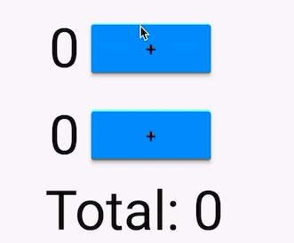

A demo using https://github.com/rrousselGit/flutter_hooks and https://github.com/rrousselGit/functional_widget to make a counter application by removing all the code duplicates.

The code showcase both the classical implementation and the one using hooks, for a side-by-side comparison. 

There's a snapshot of each steps needed for the hook based implementation on `.part` files.

THe application behaves as followed:

Before: https://github.com/rrousselGit/demo_21-01-2019/blob/master/lib/counter.dart

After: https://github.com/rrousselGit/demo_21-01-2019/blob/master/lib/full.dart